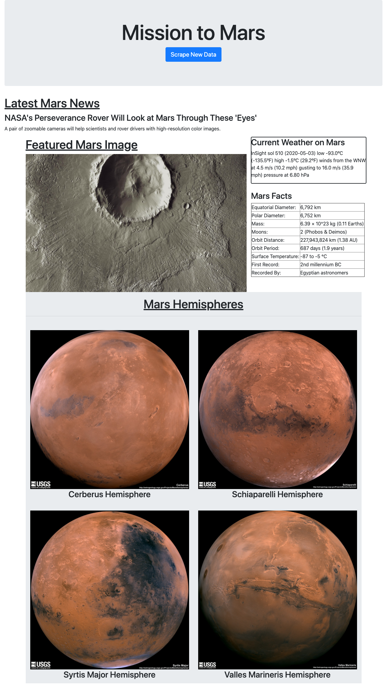

# Mission to Mars

## Background
With all the recent excitement with potential Mars colonization I wanted to build a web application that scrapes various websites for data related to the Mission to Mars and displays the information in a single HTML page

## Web Scrape
I first completed the initial scraping using Jupyter Notebook, BeautifulSoup, Pandas, and Requests/Splinter. This was stored in a Jupyter Notebook file called `mission_to_mars.ipynb`.

The following sources were scraped: 
### NASA Mars News
* Scraped the [NASA Mars News Site](https://mars.nasa.gov/news/) and collected the latest News Title and Paragraph Text.
### JPL Mars Space Images - Featured Image
* Visited the url for JPL Featured Space Image [here](https://www.jpl.nasa.gov/spaceimages/?search=&category=Mars) and used splinter to navigate the site and found the image url.
### Mars Weather
* Visited the Mars Weather twitter account [here](https://twitter.com/marswxreport?lang=en) and scraped the latest Mars weather tweet from the page.
### Mars Facts
* Visited the Mars Facts webpage [here](https://space-facts.com/mars/) and used Pandas to scrape the table containing facts about the planet including Diameter, Mass, etc. I then used Pandas to convert the data to a HTML table string.
### Mars Hemispheres
* Visited the USGS Astrogeology site [here](https://astrogeology.usgs.gov/search/results?q=hemisphere+enhanced&k1=target&v1=Mars) to obtain high resolution images for each of Mar's hemispheres. I used a Python dictionary to store the data using the keys `img_url` and `title`. I appended the dictionary with the image url string and the hemisphere title to a list. The list contains one dictionary for each hemisphere.

## MongoDB and Flask Application
I used MongoDB with Flask templating to create a new HTML page that displays all of the information that was scraped from the sources above.
* First I converted the Jupyter notebook into a Python script called `scrape_mars.py` with a function called `scrape` that executes all of the scraping code from above and returns one Python dictionary containing all of the scraped data.
* Next, I created a route called `/scrape` that imports the `scrape_mars.py` script and calls the `scrape` function.
* It then stores the return value in Mongo as a Python dictionary.
* Created a root route `/` that queries the Mongo database and pass the mars data into an HTML template to display the data.
* I then created a template HTML file called `index.html` that takes the mars data dictionary and display all of the data in the appropriate HTML elements

Below is a screenshot of the webpage.

